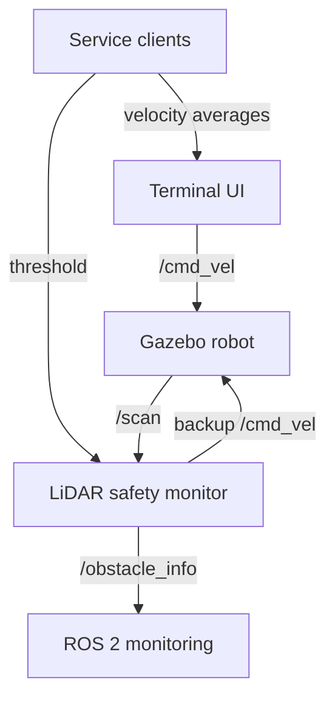

<div align="center">

# ROS 2 LiDAR Safety Controller

**A reactive safety layer for teleoperated mobile robots using live laser scans, custom ROS 2 interfaces, and runtime-configurable intervention.**

<p>
  
  
  
  
</p>

</div>

---

## Overview

This project implements a multi-node ROS 2 safety controller for a mobile robot in Gazebo. A terminal interface accepts timed linear and angular velocity commands, while a separate LiDAR monitoring node analyzes `/scan` data and triggers a short reverse manoeuvre when an obstacle enters the configured safety distance.

The system also demonstrates custom ROS 2 messages and services. Obstacle information is published through a dedicated interface, the safety threshold can be updated at runtime, and the user interface reports the average of its five most recent velocity commands.

## Key Features

| Capability | Implementation |
| --- | --- |
| Timed teleoperation | Terminal commands specify linear velocity, angular velocity, and duration |
| LiDAR monitoring | Valid readings from `/scan` are searched for the closest obstacle |
| Direction classification | Obstacles are classified as `left`, `front`, `right`, or `unknown` |
| Reactive intervention | The robot reverses briefly when the closest obstacle crosses the threshold |
| Runtime configuration | A custom service updates the active safety distance |
| Custom telemetry | Closest distance, direction, and threshold are published in `ObstacleInfo` |
| Command statistics | A service returns averages over the five most recent user commands |
| Simulation integration | The controller runs with a Gazebo Harmonic mobile-robot environment |

## System Architecture



The UI and safety monitor are independent ROS 2 nodes. The UI publishes requested motion commands, while the safety monitor observes the environment and temporarily publishes reverse commands when an unsafe distance is detected.

## Safety Behaviour

For each incoming `sensor_msgs/msg/LaserScan` message, the safety node:

1. Filters invalid, non-finite, and non-positive measurements.
2. Finds the closest valid obstacle.
3. Calculates the obstacle angle from the scan index.
4. Classifies the direction using angular sectors.
5. Publishes an `ObstacleInfo` message.
6. Starts a reverse intervention if the distance is below the active threshold.

The default safety threshold is `0.6 m`. During an intervention, the node publishes a linear velocity of `-0.2 m/s` for approximately `0.6 s`, then publishes a stop command.

This is a reactive safety demonstration rather than a complete collision-avoidance or motion-planning system. It reduces collision risk in simulation but does not provide a formal collision guarantee.

## ROS 2 Nodes

| Node | Responsibility |
| --- | --- |
| `ui_node` | Reads timed terminal commands, publishes velocity requests, and stores recent command history |
| `distance_node` | Processes LiDAR scans, publishes obstacle telemetry, and performs backup interventions |

## ROS 2 Interfaces

### Topics

| Topic | Type | Purpose |
| --- | --- | --- |
| `/scan` | `sensor_msgs/msg/LaserScan` | LiDAR measurements from the simulated robot |
| `/cmd_vel` | `geometry_msgs/msg/Twist` | User motion commands and automatic backup commands |
| `/obstacle_info` | `rt1_assignment2_interfaces/msg/ObstacleInfo` | Closest obstacle data and active threshold |

### Custom Message

`ObstacleInfo.msg`

```text
float32 closest_distance
string direction
float32 threshold
```

### Services

| Service | Type | Purpose |
| --- | --- | --- |
| `/set_threshold` | `rt1_assignment2_interfaces/srv/SetThreshold` | Updates the active safety distance |
| `/get_average_vel` | `rt1_assignment2_interfaces/srv/GetAverageVel` | Returns averages over the five latest user commands |

## Repository Structure

```text
ros2-lidar-safety-controller/
├── src/
│   ├── rt1_assignment2/
│   │   ├── resource/
│   │   ├── rt1_assignment2/
│   │   │   ├── __init__.py
│   │   │   ├── distance_node.py
│   │   │   └── ui_node.py
│   │   ├── package.xml
│   │   ├── setup.cfg
│   │   └── setup.py
│   └── rt1_assignment2_interfaces/
│       ├── msg/
│       │   └── ObstacleInfo.msg
│       ├── srv/
│       │   ├── GetAverageVel.srv
│       │   └── SetThreshold.srv
│       ├── CMakeLists.txt
│       └── package.xml
└── README.md
```

The internal ROS 2 package names are retained for compatibility with the original implementation. The public repository name describes the project independently of those package identifiers.

## Requirements

- Ubuntu 24.04
- ROS 2 Jazzy
- Gazebo Harmonic with ROS 2 integration
- Python 3
- `colcon` and `rosdep`
- [`bme_gazebo_sensors`](https://github.com/CarmineD8/bme_gazebo_sensors) simulation package

## Installation

Clone the project as a ROS 2 workspace:

```bash
git clone https://github.com/egjinaj/ros2-lidar-safety-controller.git
cd ros2-lidar-safety-controller/src
```

Clone the external simulation dependency:

```bash
git clone https://github.com/CarmineD8/bme_gazebo_sensors.git
```

Install dependencies and build the workspace:

```bash
cd ..
source /opt/ros/jazzy/setup.bash

rosdep install --from-paths src --ignore-src -r -y
colcon build --symlink-install
source install/setup.bash
```

## Running the Project

Open three terminals. Source ROS 2 and the workspace in each terminal:

```bash
source /opt/ros/jazzy/setup.bash
source ~/ros2-lidar-safety-controller/install/setup.bash
```

If the repository was cloned somewhere else, replace `~/ros2-lidar-safety-controller` with its actual path.

### Terminal 1 - Start Gazebo

```bash
ros2 launch bme_gazebo_sensors spawn_robot.launch.py
```

### Terminal 2 - Start the safety monitor

```bash
ros2 run rt1_assignment2 distance_node
```

To override the initial threshold at startup:

```bash
ros2 run rt1_assignment2 distance_node --ros-args -p threshold:=0.8
```

### Terminal 3 - Start the user interface

```bash
ros2 run rt1_assignment2 ui_node
```

Enter commands using the following format:

```text
linear_x angular_z duration_seconds
```

Example:

```text
0.2 0.0 1.5
```

Enter `q`, `quit`, or `exit` to close the interface.

## Runtime Services

### Update the safety threshold

```bash
ros2 service call /set_threshold \
  rt1_assignment2_interfaces/srv/SetThreshold \
  "{threshold: 0.4}"
```

### Get recent velocity averages

```bash
ros2 service call /get_average_vel \
  rt1_assignment2_interfaces/srv/GetAverageVel \
  "{}"
```

The response contains the average linear velocity, average angular velocity, and number of stored samples.

## Monitoring and Verification

```bash
# Observe the closest detected obstacle
ros2 topic echo /obstacle_info

# Inspect raw LiDAR measurements
ros2 topic echo /scan

# Confirm the custom services are available
ros2 service list

# Inspect the ROS 2 computation graph
rqt_graph
```

## Design Decisions

- **Separate nodes** keep terminal interaction and sensor-based safety monitoring independent.
- **Custom interfaces** provide structured obstacle telemetry and strongly typed service requests.
- **Invalid-scan filtering** prevents unusable LiDAR values from influencing the closest-distance result.
- **A rolling five-command history** bounds memory use while providing recent operator statistics.
- **Runtime threshold updates** allow the safety distance to change without restarting the node.
- **Timer-driven backup commands** avoid blocking the ROS 2 executor during an intervention.

## Scope and Limitations

- The response is reactive and does not calculate an alternative path.
- Both nodes publish to `/cmd_vel`; the project does not implement a dedicated command-arbitration multiplexer.
- Direction classification uses fixed angular sectors.
- Backup speed and duration are fixed in the current implementation.
- The controller is designed for simulation and has not been validated on a physical robot.

## Potential Extensions

- Add a velocity multiplexer for explicit command priority
- Replace fixed backup behaviour with closed-loop recovery
- Add configurable direction sectors and intervention velocity
- Provide a launch file for the complete system
- Record safety events and minimum-distance statistics
- Add automated tests for scan filtering and service validation
- Extend the controller with local path replanning

## External Simulation Package

The Gazebo robot model and simulation assets are provided by the [`bme_gazebo_sensors`](https://github.com/CarmineD8/bme_gazebo_sensors) project. This repository focuses on the ROS 2 Python controller and custom interfaces.

## Author

**Endri Gjinaj**  
MSc Robotics Engineering student, University of Genoa  
[GitHub Profile](https://github.com/egjinaj)

---

<div align="center">
  <sub>Built to explore LiDAR processing, custom ROS 2 interfaces, and reactive robot safety control.</sub>
</div>

